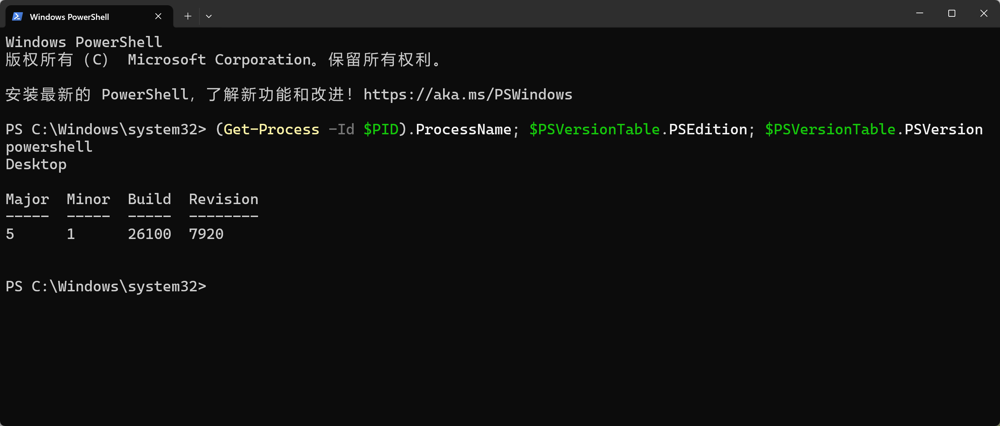
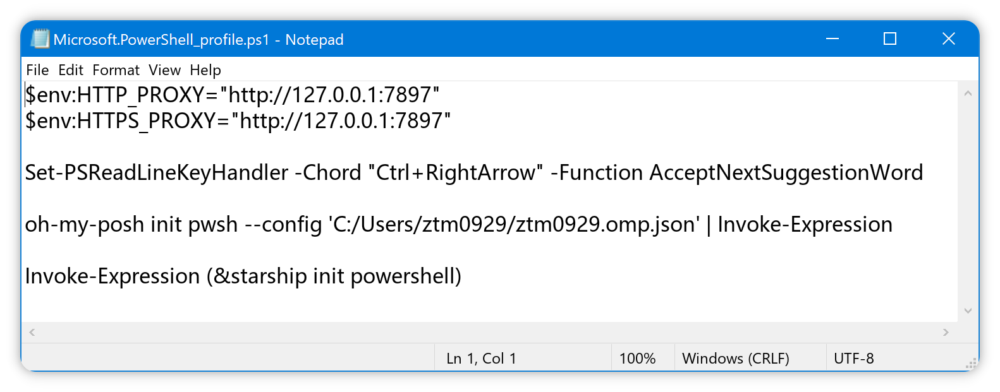

很多人打开了系统代理，却发现终端里的下载、安装、更新命令还是慢。原因通常不是网络本身，而是终端会话里没有持续生效的代理环境变量。本文会带你用最少步骤，把 Windows 下的终端代理配置成“开终端就可用”，让后续常见命令长期稳定加速。

## 你将获得

- 终端新窗口自动加载代理
- git/pip 等命令运行速度提升

## 开始之前

- [x] 已安装 Windows Terminal（终端）

## 动手操作

<div className='fd-steps [&_h3]:fd-step'>

### 确认当前的 Shell 版本

这行命令在做三件事，查看当前 Shell 的名称、类型和版本：

```powershell title="Windows Terminal（终端）"
(Get-Process -Id $PID).ProcessName; $PSVersionTable.PSEdition; $PSVersionTable.PSVersion
```

```
powershell
Desktop

Major  Minor  Build  Revision
-----  -----  -----  --------
5      1      26100  7920
```



### 注入环境变量

```
$env:HTTP_PROXY="http://127.0.0.1:7897"; $env:HTTPS_PROXY="http://127.0.0.1:7897"
```

### 确认注入成功

```powershell title="Windows Terminal（终端）"
$env:HTTP_PROXY; $env:HTTPS_PROXY;
```

</div>

## 常见问题

## 下一步

```powershell title="Windows Terminal（终端）"
notepad $PROFILE

# 两种方式都能用记事本打开配置文件
notepad $HOME\Documents\PowerShell\Microsoft.PowerShell_profile.ps1
```



在打开的文件中添加以下内容：

```powershell title="$HOME\Documents\PowerShell\Microsoft.PowerShell_profile.ps1"
$env:HTTP_PROXY="http://127.0.0.1:7897"
$env:HTTPS_PROXY="http://127.0.0.1:7897"
```


```powershell
# 1. 确保 profile 文件存在
$profileDir = Split-Path -Parent $PROFILE
if (!(Test-Path $profileDir)) {
    New-Item -ItemType Directory -Path $profileDir -Force | Out-Null
}
if (!(Test-Path $PROFILE)) {
    New-Item -ItemType File -Path $PROFILE -Force | Out-Null
}

# 2. 要追加的内容
$httpLine = '$env:HTTP_PROXY="http://127.0.0.1:7897"'
$httpsLine = '$env:HTTPS_PROXY="http://127.0.0.1:7897"'

# 3. 读取现有内容（允许空文件）
$content = Get-Content $PROFILE -Raw -ErrorAction SilentlyContinue

# 4. 分别检查并追加，避免漏写其中一行
if ($content -notmatch [regex]::Escape($httpLine)) {
    Add-Content -Path $PROFILE -Value "`n$httpLine"
}
if ($content -notmatch [regex]::Escape($httpsLine)) {
    Add-Content -Path $PROFILE -Value "`n$httpsLine"
}

# 5. 当前终端立即生效
. $PROFILE

# 6. 验证
echo $env:HTTP_PROXY
echo $env:HTTPS_PROXY
```

> 注意：上面是为 PowerShell 启动时自动设置代理（仅对 PowerShell 会话生效）。
> 如果你希望“系统级/所有程序”长期生效，请使用系统环境变量（例如 setx），并重新打开终端或重启相关程序。