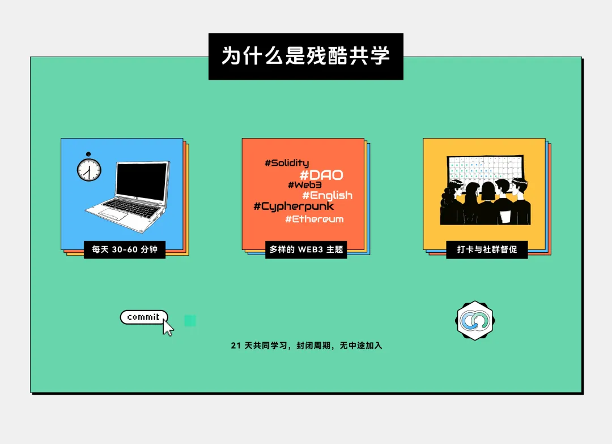

在这个知识爆炸的时代，优质学习资源触手可及，但持续学习却越发困难。工作繁忙的人们难以像从前那样坐在教室里专注学习，而独自在线学习又常因缺乏动力和同伴支持而半途而废。“残酷共学”通过严格的学习规则和开放协作机制，让网络自学变得更有规律和效率，目前已帮助数百位学习者建立起持续学习的好习惯。

未来的学习方式是否还会像过去和现在这样？拥有一间教室和老师，半年为一个学期，传授体系化的知识？我们认为或许会有更好的解决方案。

作为毕业多年的人，我们再也没有这么大段的时间找到一个固定的教室上课。随着网络的发展，我们可以找到非常好的高质量的学习资料，而且只学习自己想学习的内容。

但是这个过程中，缺少一些坚持和推动，同时少了一些同学之间的交流，因此共学是一个不错的学习和再教育机制。

## 共学是什么，「残酷共学」又是什么

当我问 ChatGPT 什么是共学，它的回答是：“共学是指学习者在一个共享的环境中，为了实现共同的目标或任务，通过互动、知识分享和协作共同学习和成长的过程。”共学目前是一种很普遍的学习和教育的方式，在很多社区或者教育类项目中都采用类似的机制学习，而「残酷共学」与普通共学不同的地方在于添加了一些的“残酷”的共学规则，例如：

- 整个学习周期控制在 21 天，构建一个不错的学习习惯，中途不能加入。
- 每天都必须要学习，至少 30 分钟，最好一个小时。
- 学习的笔记和 Proof 上传到 GitHub，公开透明，相互监督。
- 每周最多请假两次，一旦打卡失败，将会被视为淘汰，自动退出本次「残酷共学」。

“残酷”的共学规则虽然简单，但是借鉴了一些游戏化的机制使其简单却高效，主要体现在：

- 心智简单：不要想太多，每天都要学习，没有任何理由和接口，学习就完事了。
- 社交压力：我报名的时候承诺了我要完成，同学相互监督，增加了坚持下来的动力和几率。
- 只有三周：不至于太短无法深入学习某个课题，也不至于过长很难坚持下来。

除此之外，基于 GitHub 设计的共学流程，同时还实现了类似区块链的一些特点和文化：

- 完全远程：整个残酷共学都是基于线上进行的，只要有网络就可以学习，没有线下空间，没有地域限制。你可以在任何时区加入学习，打卡的时间也是基于你的时区计算的。
- 开源开放：所有学习笔记基于 GitHub 都是开放、开源的，任何人都可以看到所有报名者的打卡记录和学习笔记，即使你没有赶上报名，也可以学习大家的资料和笔记。提供了很多原创的资料。
- 去中心化：我们并不需要一个老师才可以开始学习，每个人都可以自由的发起一场「残酷共学」，拉上自己的朋友一起打卡学习。
- 无需许可：任何人有想要学习的资料都可以发起残酷共学，任何人也都可以提交报名参与这个「残酷共学」，学习是一个自由的、无需许可的事情。

残酷共学也是十分有效的：

- 学到知识：「残酷共学」强调坚持和输出，这是学习最好的方式。每天必须打卡也避免了传统共学的三天热度的问题。而且只学习自己最感兴趣和目前最需要的知识。
- 运营成本非常低：一本书、一个系列视频、几篇文档、一个论文，任何资料都可以经过策展之后用于发起一个残酷共学。这一切并不需要一些讲师精心备课才可以进行，任何人都可以发起。学到知识就是最大的奖励，我们也不鼓励和强调必须要有奖金才来学习。
- 运营和活跃社区：在社区里面大家一起学习和研讨相关的内容，构建更紧密的关系，提升大家对于内容深度的理解，吸引更多志同道合的朋友。此外，也可以跨社区共同发起，增进社区之间的交流。
- 产出原创内容：每个人的笔记都非常独特且原创，在这个过程中，我们挖掘出来了很多新的想法。对于「残酷共学」的发起方来说，也收获了不错的反馈。
- 识别优秀的朋友：可以坚持完成共学并且笔记富有美感的朋友天生自带吸引力，是很不错的人才。

这些效果也通过我们半年的实际运营得到了积极的反馈和验证，因此，我们将推动「残酷共学」的正式立项，将其更加简单易用，方便推广使用。

## 正式发起「残酷共学」教育公共物品

「残酷共学」的学习方法最早源于 Bruce Xu 在 19 年学习数学的时候做的一个实验，并且收获了不错的结果。之后在 24 年 4 月份在学习以太坊协议的时候，Bruce 重新使用了类似的学习模式（https://x.com/brucexu_eth/status/1775319533420736993），并得到了很不错的反馈和效果。因此总结之后，Bruce 在 LXDAO 发起了「残酷共学」这个项目和想法，并交由 LXDAO 主推运营（https://forum.lxdao.io/t/topic/1654），目前由 Muxin 担任 PM。在这半年的时间，LXDAO 已经组织并运营开展了 9 场不同主题的「残酷共学」，其中包括：

- 「英语残酷共学」，大家一起学习英语，提高国际交流的水平。
- 跟 EthStorage 合作的 「Web3-URL 残酷共学」，让更多开发者了解相关新技术，并且给团队提供了很多反馈和问题。
- 跟 Uncommons 合作的 「Narrative-Reading 残酷共学」，从人文视角一起探索经典与区块链的交汇点，构建未来社会。
- 等等等等

在这个过程中还吸引了其他组织（比如 DeFiHackLabs）采用残酷共学模式组织的 Web3 CTF 残酷共学 和 Solidity 残酷共学，吸引了很多开发者加入他们社区。

「残酷共学」的学习模式得到了参与者的认可和好评，目前共计 356 人次报名参与，已完成的残酷共学的平均淘汰率为 60.32%，每期都会有打卡全勤的参与者，从结果上看非常残酷，但却还是会有参与者坚持到最后。

基于「残酷共学」的运行情况，以及它所产生的积极影响，我们有充足的信心它将会成为未来赛博世界的教育类的重要公共物品。我们认为它是一个针对教育领域的协调问题解决方案，优化了教学资料、学习者之间的关系和运行效率。因此，我们为其设置了一个重要里程碑，希望未来有 23553806 人次报名和使用这种方式学习，因为这些人连起来可以围绕地球一圈。

## 「残酷共学」Roadmap

「残酷共学」正式在 LXDAO 立项之后，我们将投入一部分研发资源为其开发网站和自动化的工具，使其更加的简单易用易于发起和寻找自己想要学习的课程。同时对大家的笔记进行索引，方便大家搜索和学习其他人的笔记。此外，我们也将会在未来增加学习相关的功能，包括勋章、证书、质押奖金等。我们大体的 Roadmap 如下：

- 第一阶段：完成基础官网和自动化工具，方便搜索、筛选和发起自己感兴趣的共学。同时可以自动化的查看打卡和学习笔记等。同步进入运营阶段，将持续性的推动多个社区和组织发起相关共学。探索「残酷共学」的商业可持续性。
- 第二阶段：根据第一阶段的反馈和获取的资源，我们将继续打磨「残酷共学」，打磨、完善和增加相应的功能，使学习过程更加简单、有趣，并为第三阶段的扩展打好基础。此外「残酷共学」也将完成自己的商业可持续性。
- 第三阶段：基础的模式、工具皆已成型，开始进行品牌、理念的宣传推广，逐步扩大学习的人群和使用范围，形成新的学习方式和潮流。「残酷共学」也将产生额外营收，我们会将额外收入反哺到对其他公共物品生态的资助上面。

## 我们需要你的支持

在目前 Web3 浮躁的大环境下，如果你想成为一名优秀的 Web3 Buidler，能静下心来认真学习某一项技能获得新的知识是非常可贵的。我们欢迎你来一起学习，也欢迎发起「残酷共学」集结志同道合的学习伙伴。你一定会收获满满的！

LXDAO 已经提供了一个季度的孵化支持和资金，「残酷共学」项目正在申请 Grants 来开展我们下一个阶段的重要工作。我们希望能够获得您的赞助支持，以支持至少一年的项目建设和运营，顺利推进前两个阶段的目标。这些支持将主要用于平台开发维护、品牌推广，以及部分重点共学活动的激励。「残酷共学」作为一个免费的公共物品，短期内可能无法实现显著的商业化收益，因此也希望赞助方对回报预期保持合理心态。不过，如果未来探索出适合的商业化模式，您的支持也将被优先考虑，享有相应的回报权益。

有任何的问题和想法，请联系目前 PM Muxin，Telegram: muxin_eth，WeChat:  _muxin_00。

关于残酷共学的更多信息：

GitHub：https://github.com/IntensiveCoLearning

更多相关讨论在论坛：https://forum.lxdao.io/t/topic/1654

残酷共学教育项目提案：https://snapshot.org/#/lxdao.eth/proposal/0xc23892686634688e48a7a140a8bdff9438cdfba03a2c57160a0ccb8412614533

